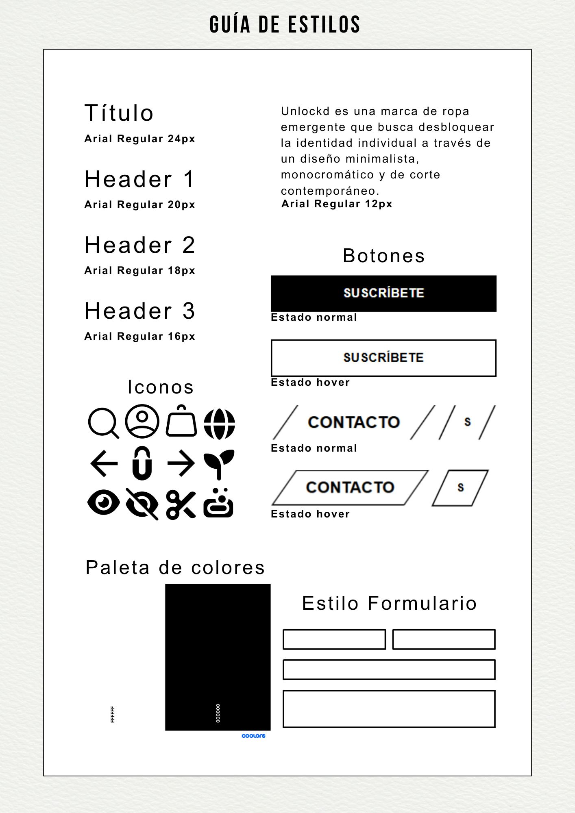
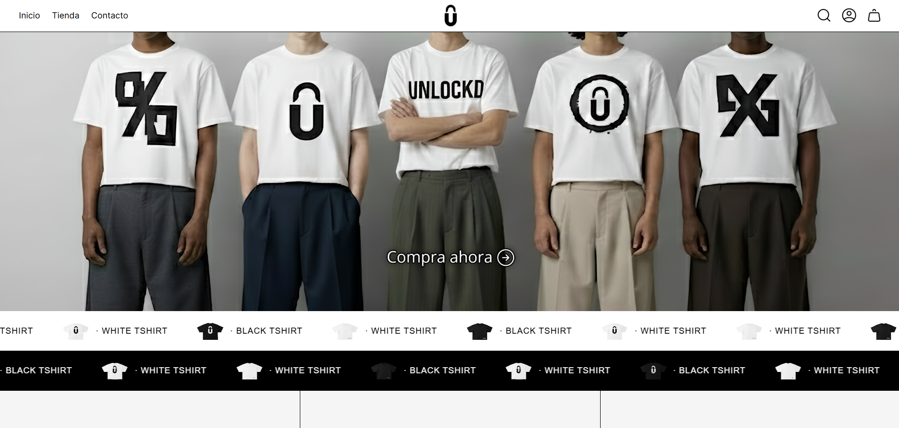

# Unlockd

**Unlockd** es una marca de ropa emergente que busca desbloquear la identidad individual a través de un diseño minimalista, monocromático y de corte contemporáneo. Este proyecto constituye el desarrollo técnico y visual de su plataforma de e-commerce.

---

## Identidad Visual y Diseño
El diseño de Unlockd se basa en la simplicidad y el contraste, utilizando una estética urbana y limpia para resaltar el producto.

### Guía de Estilos
He desarrollado un sistema de diseño propio para asegurar la consistencia visual en toda la plataforma:

 

### Interfaz de Usuario (UI)
La web apuesta por un diseño funcional donde el contenido visual es el protagonista.

---

## Tecnologías Utilizadas
- **Frontend:** HTML5, CSS3 y Javascript.
- **Control de Versiones:** Git & GitHub.
- **Herramientas de Diseño:** Canva.

---

## Características Principales
- **Experiencia de Usuario (UX):** Navegación fluida y minimalista enfocada en la compra rápida.
- **Componentes Personalizados:** Botones con micro-interacciones (hover) y selectores de tallas optimizados.
- **Diseño Responsivo:** Adaptado para una visualización correcta en distintos dispositivos.

---