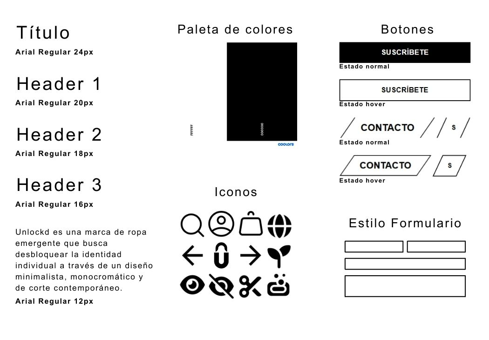
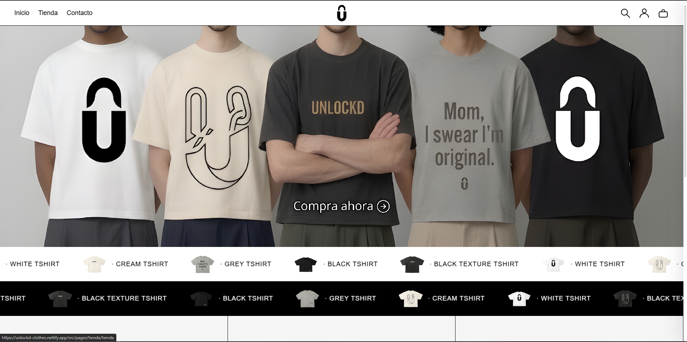
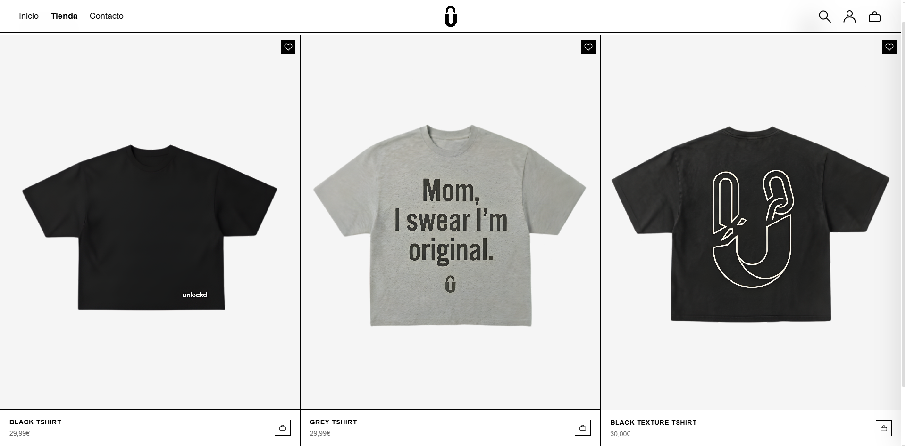
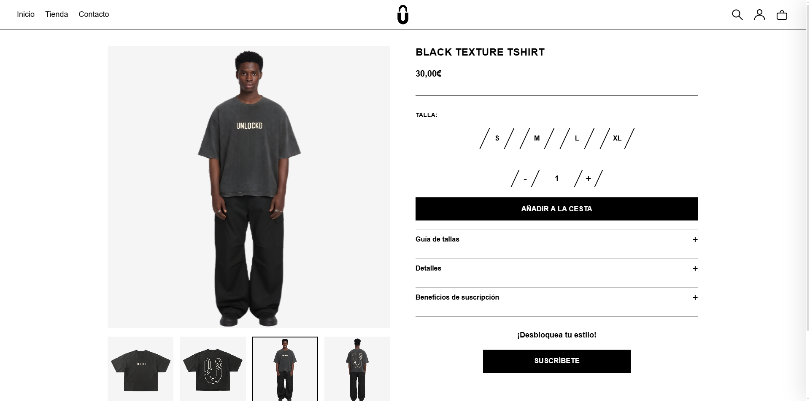
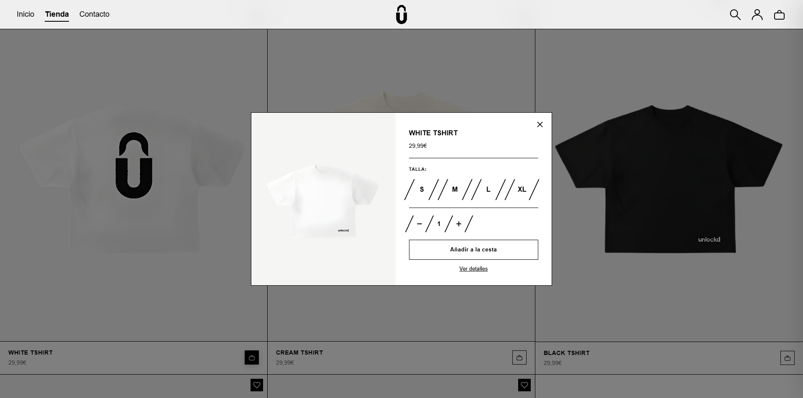
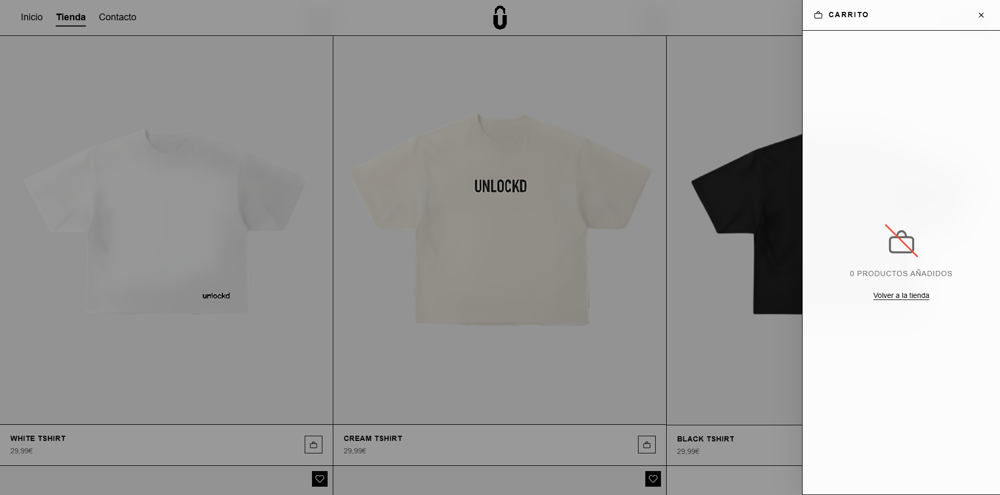
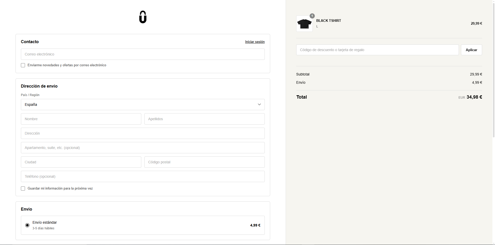
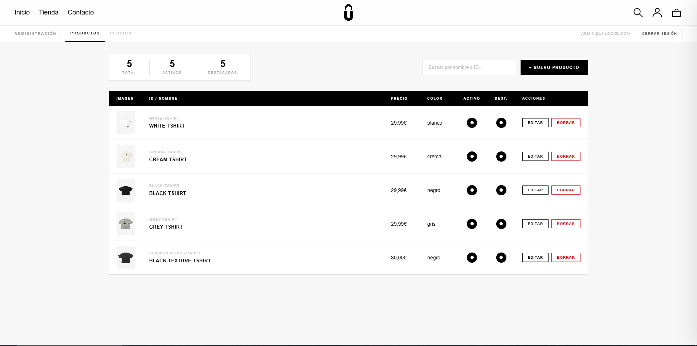
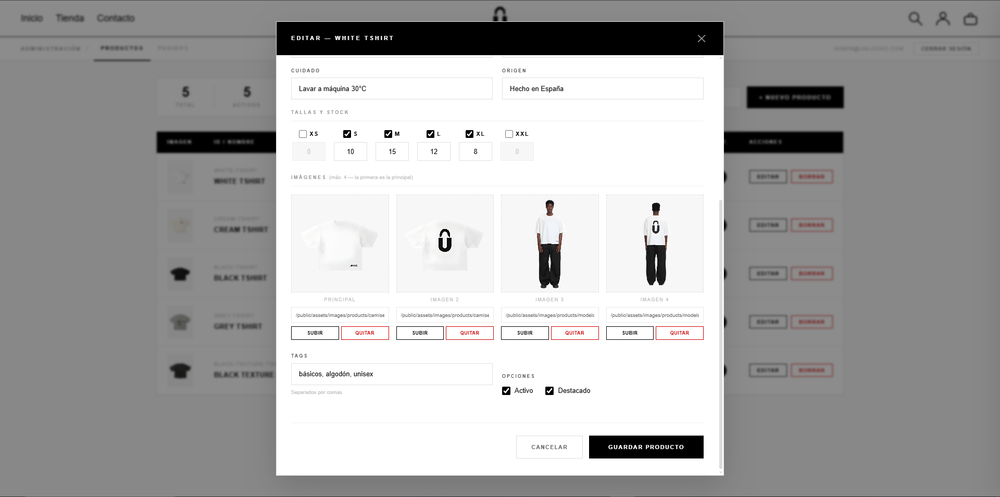

<h1 align="center">
  Unlockd
</h1>

<p align="center">
  
  
  
  
  
</p>

**Unlockd** es una marca de ropa emergente que busca desbloquear la identidad individual a través de un diseño minimalista, monocromático y de corte contemporáneo. Este proyecto constituye el desarrollo técnico, arquitectónico y visual de su plataforma de e-commerce completa.

---

## Interfaz Visual y Diseño

El diseño de Unlockd se basa en la simplicidad y el contraste, utilizando una estética urbana y limpia para resaltar el producto. A continuación, se muestran los elementos clave de la interfaz:

### 1. Guía de Estilos


### 2. Página Principal (Home)


### 3. Vista de la Tienda


### 4. Vista del producto


### 5. Detalles del Producto y QuickAdd


### 6. Carrito de Compras


### 7. Proceso de Pago (Checkout)


### 8. Panel de Administrador



---

## Tecnologías Utilizadas

El proyecto está desarrollado utilizando una arquitectura moderna de cliente-servidor (Frontend y Backend desacoplados):

### Frontend
- **HTML5 & CSS3:** Estructura semántica y estilos modulares (Vanilla CSS) organizados por componentes (BEM methodology adaptada).
- **JavaScript (ES6+):** Lógica asíncrona, manipulación del DOM, interacciones de UI (QuickAdd, Carrito lateral) y consumo de API REST.
- **Diseño Responsivo:** Mobile-first, garantizando una adaptación total a dispositivos móviles, tablets y escritorio.

### Backend
- **Node.js con Express:** Servidor robusto y escalable para el enrutamiento y la API RESTful.
- **Seguridad (JWT & Helmet):** Autenticación sin estado mediante JSON Web Tokens en cookies `httpOnly` para evitar ataques XSS, y configuración de cabeceras HTTP seguras.
- **Nodemailer:** Integración de SMTP para el envío automático de correos transaccionales (confirmación de cuentas, recuperación de contraseñas, resúmenes de pedidos).
- **Gestión de Archivos:** Servicio de archivos estáticos para la distribución eficiente de las imágenes del catálogo.

---

## Características Principales y Funcionalidades

El proyecto abarca el flujo completo de una aplicación de E-commerce:

* **Gestión de Usuarios:** Registro, inicio de sesión, verificación por email y recuperación de contraseña segura.
* **Catálogo interactivo:** Buscador en tiempo real, filtros y componente *QuickAdd* para añadir productos al carrito sin cambiar de contexto.
* **Carrito y Checkout avanzado:** Carrito dinámico, página de checkout detallada, gestión de direcciones de envío e integración de cupones de descuento.
* **Historial de Pedidos:** Panel de cuenta de usuario con desglose histórico y vista individual de cada compra.
* **Panel de Administración (API):** Rutas protegidas por roles para la gestión del inventario, los cupones y los pedidos.
* **Comunicación automatizada:** Correos de confirmación en cada etapa crítica del usuario.

---

## Rutas Principales de la API REST

Una vista rápida de los principales endpoints del servidor:

| Endpoint | Método | Descripción
|---|---|---|
| `/api/auth/register` | `POST` | Registra un nuevo usuario y envía email 
| `/api/auth/login` | `POST` | Autentica al usuario y genera cookie JWT 
| `/api/products` | `GET` | Devuelve el catálogo de productos 
| `/api/orders` | `POST` | Genera un nuevo pedido 
| `/api/coupons/apply` | `POST` | Verifica la validez de un cupón 
| `/api/addresses` | `GET/POST` | Gestiona las direcciones del cliente 

---

## Variables de Entorno

Para ejecutar el backend en local, es necesario crear un archivo `.env` en la carpeta `/server` basándose en las siguientes claves:

```env
PORT=3000
MONGO_URI=tu_cadena_de_conexion_a_base_de_datos
JWT_SECRET=tu_secreto_super_seguro
SMTP_HOST=smtp.gmail.com
SMTP_PORT=587
SMTP_USER=tu_correo@gmail.com
SMTP_PASS=tu_contraseña_de_aplicacion
```

---

## Estructura del Proyecto

```text
Unlockd/
├── client/                 # Ecosistema Frontend
│   ├── public/assets/      # Imágenes y recursos gráficos
│   ├── src/pages/          # Vistas HTML (auth, tienda, checkout, etc.)
│   ├── src/styles/         # Hojas de estilo CSS modulares
│   └── src/scripts/        # Lógica JavaScript por página y componentes
└── server/                 # Ecosistema Backend
    ├── src/controllers/    # Lógica de negocio de la API
    ├── src/routes/         # Definición de endpoints
    ├── src/middleware/     # Autenticación, CORS, manejo de errores
    └── src/utils/          # Herramientas como Nodemailer
```

---

## Instalación y Despliegue Local

1. **Clonar el repositorio:**
   ```bash
   git clone https://github.com/jfmartinez10/Unlockd.git
   ```

2. **Configurar el Backend:**
   ```bash
   cd server
   npm install
   ```
   *No olvides crear el archivo `.env` mencionado anteriormente.*

3. **Iniciar el Backend:**
   ```bash
   npm run dev
   ```

4. **Ejecutar el Frontend:**
   Abre la carpeta `/client` en tu editor (ej. VSCode) y lanza las vistas utilizando **Live Server** u otro servidor estático para permitir la comunicación fluida con la API.

---

## Posibles Mejoras (Roadmap)
- Integración real con pasarelas de pago (Stripe).
- Panel visual de administración (Dashboard) en el cliente para el rol *Admin*.
- Soporte multilenguaje (i18n).

---

## Licencia y Autoría

Desarrollado como Proyecto de Fin de Grado (TFG) por **jfmartinez10**.